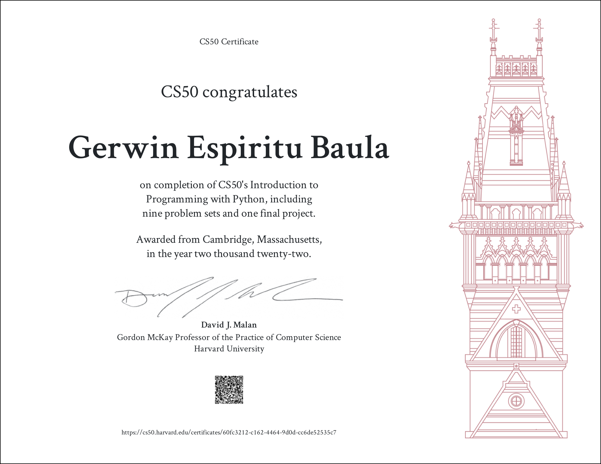

# CS50P

An introduction to programming using a language called Python where I learned the the following:

- Functions and variables
- Conditionals
- Loops
- Exceptions
- Libraries
- File I/O
- Regular Expressions
- Object-oriented Programming

## Certificate of Completion

